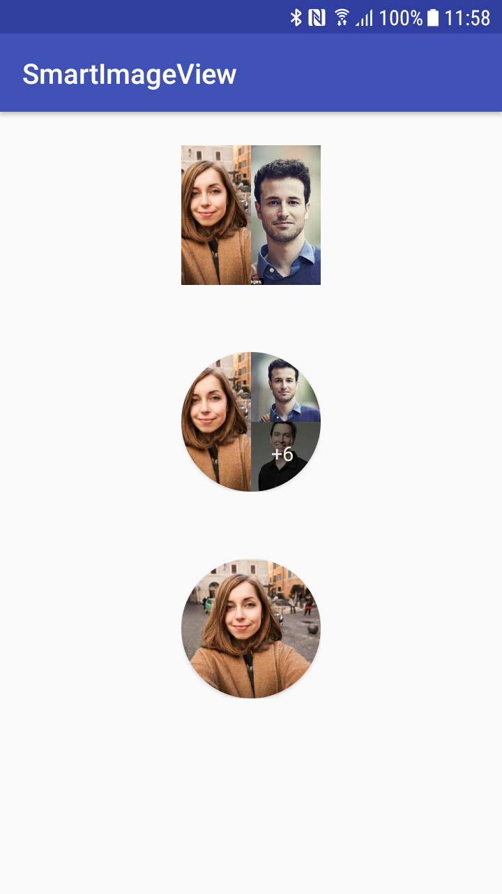

# SmartImageView 
Smart Image View for Android where you can add multiple images and choose the shape (circle or square) and the size.

# Screenshot

# Integration

<b>Gradle</b>

Step 1. Add the JitPack repository to your build file

Add it in your root build.gradle at the end of repositories:

	allprojects {
		repositories {
			...
			maven { url 'https://jitpack.io' }
		}
	}
Step 2. Add the dependency

	dependencies {
	       implementation 'com.github.Dinox869:smartimageview:0.0.1'
	}

<b>Maven</b>

Step 1. Add the JitPack repository to your build file
	
	<repositories>
		<repository>
		    <id>jitpack.io</id>
		    <url>https://jitpack.io</url>
		</repository>
	</repositories>
	
Step 2. Add the dependency

	<dependency>
	    <groupId>com.github.Dinox869</groupId>
	    <artifactId>smartimageview</artifactId>
	    <version>Tag</version>
	</dependency>
	
# How to Use

Only thing you have to do is giving as many URLs as you want to the Layout with putImages function. Shape and size can be arranged via XML file. 
In XML:

    <com.teleclinic.bulent.smartimageview.SmartImageViewLayout
        android:id="@+id/images1"
        android:layout_width="100dp"
        android:layout_height="100dp"
        android:layout_margin="24dp"
        android:layout_gravity="center"
        app:shape="SQUARE"/>

    <com.teleclinic.bulent.smartimageview.SmartImageViewLayout
        android:id="@+id/images2"
        android:layout_width="100dp"
        android:layout_height="100dp"
        android:layout_margin="24dp"
        android:layout_gravity="center"
        app:shape="CIRCLE"/>
	
In Activity:

	images1.putImages(url1, url2, ...)
	images2.putImages(url1)
	
Library being used to show pictures is *Glide 4* (https://github.com/bumptech/glide).
